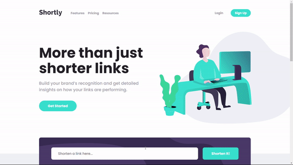
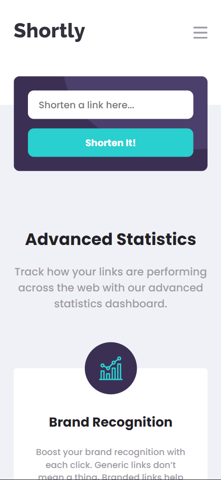
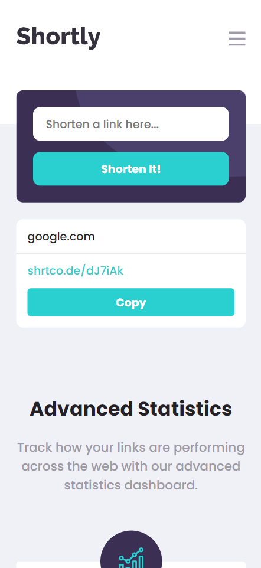

# Frontend Mentor - Shortly URL shortening API Challenge solution

This is a solution to the [Shortly URL shortening API Challenge challenge on Frontend Mentor](https://www.frontendmentor.io/challenges/url-shortening-api-landing-page-2ce3ob-G). Frontend Mentor challenges help you improve your coding skills by building realistic projects.

### The challenge

Users should be able to:

- View the optimal layout for the site depending on their device's screen size
- Shorten any valid URL
- See a list of their shortened links, even after refreshing the browser
- Copy the shortened link to their clipboard in a single click
- Receive an error message when the `form` is submitted if:
  - The `input` field is empty

### Screenshot

  
  
  

### Links

- Live Site URL: [Link](https://jonascavalcante.github.io/url-shortening-api/)

### Built with

- HTML5
- SASS
- JavaScript

### Author

- LinkedIn - [@jonascavalcante](https://www.linkedin.com/in/jonascavalcante/)
- Frontend Mentor - [@jonascavalcante](https://www.frontendmentor.io/profile/jonascavalcante)
